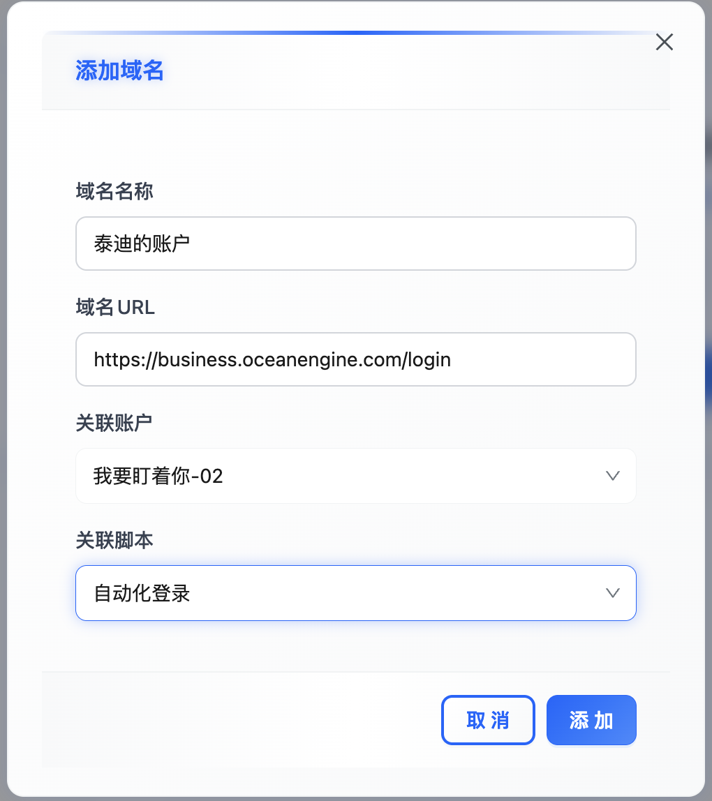

# 🌐 软件介绍

> **这是一款没什么鸟用的软件，鸟不用我用！**

---

## 🔧 1. 基本功能

> **简单实现浏览器多开**

就拿QQ邮箱做示例，同时登录俩邮箱。没毛用，多开个浏览器也成。

### 📝 操作步骤

**先整俩名人的号 乔布斯 & 雷布斯**

搁域名管理里加俩OICQ邮箱地址  
就理解成：后面会打开两个浏览器，分别都访问OICQ邮箱地址，然后分别登录俩号

**然后分别登录就是下面这鸟样**

上面的标签页说白了就是你有俩浏览器  
第二排的标签页就是你浏览器的标签页

听不懂是吧？算鸟

---

## 🚀 2. 核心功能

> **自动化登录，免得每次还要输入密码**  
> **演示案例：巨量千川**

### 📋 操作顺序

1. 先到脚本管理里头，不是油搞里头，添加一个记录，选择巨量千川这个预选脚本，脚本名字填上，保存...
2. 再到账户管理里添加需要登录的账户，用户名密码，会直接应用到脚本中的...
3. 再到域名管理加俩记录，说白了就是相当于打开俩浏览器，分别访问巨量千川，名字你得起好，起码你得分得清是盯的是谁。
4. 直接点击域名卡片记录的『打开』按钮，握草，握草草，直接登录了，你说神奇不神奇，神经不神经，就这么神经
5. 一个账户下是不是要盯好多广告户，那你就选择你的广告户进去页面，如果是盯直播，就到直播间，然后点击链接栏右侧的收藏按钮，起个屌逼的名字，必须屌，屌到一眼认得出

### 📸 操作截图

**加预选脚本**

**加登录账户**

**加域名记录(浏览器多开)**

**添加书签(盯户，盯直播)**

---

## ⚙️ 3. 自定义脚本

我可不是盯巨量千川，我盯别的，我也要登录~  
行叭，不选预选脚本，搁脚本输入框里写js代码，寄几个儿完成...  
不会？？？？  
找我？？？？  
得加钱~

